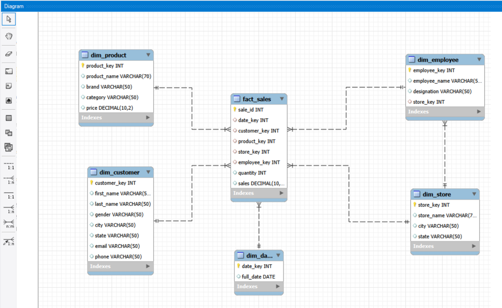
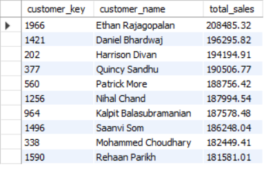
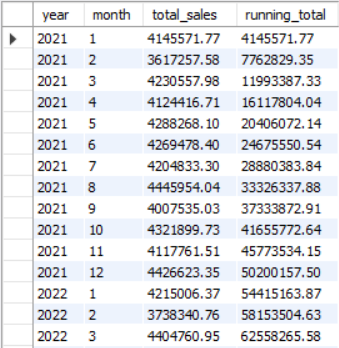
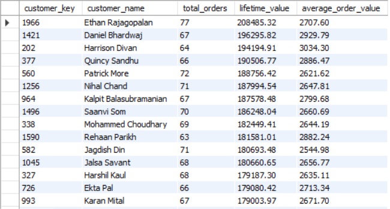
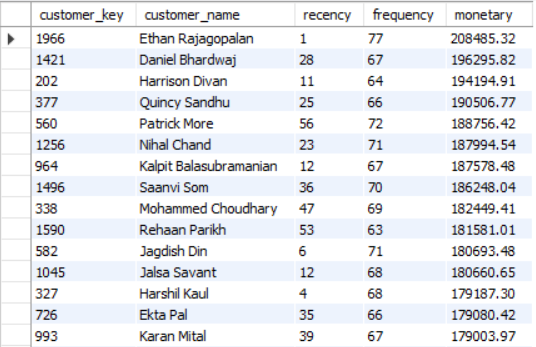

# 🛒 Retail Sales SQL Project

## 📌 Project Overview

This project demonstrates an end-to-end retail sales analysis using **MySQL**. It covers database design, data cleaning, business analysis, advanced SQL techniques, performance optimization, and analytical reporting.

The project showcases practical SQL skills used in real-world data analytics and business intelligence.

---

## ✨ Features

- Designed a normalized retail sales database
- Imported and managed CSV datasets in MySQL
- Performed data cleaning and validation
- Solved business problems using SQL queries
- Applied advanced SQL concepts such as CTEs, Window Functions, and Views
- Optimized query performance using indexes
- Conducted Customer Lifetime Value (CLV) and RFM Analysis

---

## 🛠️ Tech Stack

- MySQL
- SQL
- Relational Database Design
- Git & GitHub

---

## 📂 Project Structure

```
Retail-Sales-SQL-Project/
│
├── dataset/
│   ├── dim_customer.csv
│   ├── dim_date.csv
│   ├── dim_employee.csv
│   ├── dim_product.csv
│   ├── dim_store.csv
│   └── fact_sales.csv
│
├── documentation/
│   ├── data_dictionary.md
│   └── er_diagram.png
│
├── screenshots/
│   ├── top_customers.png
│   ├── running_total.png
│   ├── customer_lifetime_value.png
│   └── rfm_analysis.png
│
├── sql/
│   ├── 01_database_setup.sql
│   ├── 02_data_cleaning.sql
│   ├── 03_business_analysis.sql
│   ├── 04_advanced_sql.sql
│   ├── 05_performance_optimization.sql
│   └── 06_advanced_business_analysis.sql
│
└── README.md
```

---

# 📊 Database Schema (ER Diagram)



---

# 📖 Data Dictionary

The detailed data dictionary is available here:

📄 **[Data Dictionary](documentation/data_dictionary.md)**

---

# 🚀 Project Workflow

### 1. Database Setup

- Created the Retail database
- Designed dimension and fact tables
- Defined primary and foreign keys
- Imported CSV datasets into MySQL

---

### 2. Data Cleaning

- Removed duplicate records
- Standardized data formats
- Handled NULL values
- Improved overall data quality

---

### 3. Business Analysis

Performed SQL analysis to answer key business questions, including:

- Top-performing customers
- Revenue by product category
- Monthly sales trends
- Store performance
- Employee sales performance

---

### 4. Advanced SQL

Implemented advanced SQL concepts including:

- Common Table Expressions (CTEs)
- Window Functions
- Running Totals
- Ranking Functions
- Moving Averages
- Views

---

### 5. Performance Optimization

- Created indexes
- Compared query execution plans
- Improved query performance

---

### 6. Advanced Business Analysis

Performed advanced analytical techniques including:

- Customer Lifetime Value (CLV)
- RFM Analysis
- Customer Segmentation

---

# 📷 Sample Analysis Results

## Top 10 Customers



---

## Running Total of Monthly Sales



---

## Customer Lifetime Value (CLV)



---

## RFM Analysis



---

# ⭐ Key SQL Concepts Demonstrated

- Database Design
- Primary & Foreign Keys
- Joins
- Aggregate Functions
- GROUP BY & HAVING
- Subqueries
- Common Table Expressions (CTEs)
- Window Functions
- Views
- Indexing
- Performance Optimization

---

# 📈 Project Highlights

- End-to-End SQL Project
- Real-World Retail Sales Dataset
- Business-Oriented SQL Analysis
- Advanced SQL Techniques
- Query Performance Optimization
- Well-Structured Project Documentation

---

## 👩‍💻 Author

**Janvi Rathore**

- LinkedIn: [Janvi Rathore](https://www.linkedin.com/in/janvirathore25)

---

## 📄 License

This project is intended for educational and portfolio purposes.

